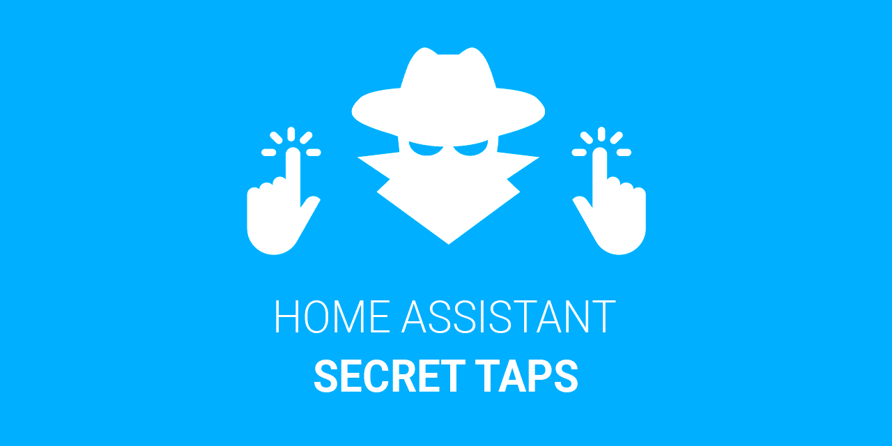

# Home Assistant Secret Taps



### Execute Home Assistant actions just tapping on your device.

[](https://github.com/hacs/integration)
[](https://github.com/elchininet/home-assistant-secret-taps/actions/workflows/hacs.yaml)
[](https://github.com/elchininet/home-assistant-secret-taps/actions/workflows/tests.yaml)
[](https://coveralls.io/github/elchininet/home-assistant-secret-taps?branch=master)

[](https://github.com/elchininet/home-assistant-secret-taps/actions/workflows/ha-beta-tests.yaml)

>Do not take this plugin as a security measure. Anything on client side is insecure by default and anyone with the minimum knowldge and with access to the device can inspect the code, the network tab and check your secrets. This is more intended to avoid kids/spouse/friends to interact with certain elements/entities of Home Assistant.

In Home Assistant, it is very common to hide or restrict elements from non-admins users. There are multiple HACS plugins that are used to restrict critical sections, dasboards, UI elements, cards, etc. from unauthorized users ([kiosk-mode], [custom-sidebar], [lovelace-state-switch], are some of them). This is a recurrent task in kiosk devices that are intended to be used by the whole family or by a large group of users. The issue comes when the owner or admin wants to interact with those elements on the device because these elements are hidden also for them.

Even if those elements could be shown switching some entity, the admin needs to go to a device in which that entity is visible to be able to interact with it. It is something no so straightforward to do on the same restricted device.

But what about showing the desired element, navigating to the desired dashboard, or switching the desired entity not with an UI element but with something hidden and only known by the admin/owner?

This is when `Home Assistant Secret Taps` comes to scene, you can configure "secrets" based on sequences of taps on the screen and perform certain actions when these secret taps are executed. Call a service, open the more-info dialog of an entity or navigating to a dashboard are the main actions that could be performed only touching in any part of the screen using the correct sequence.

**Do you have the header hidden and to show it you need to change an `input_boolean`?**

 You can configure a sequence of taps that will call the `toggle` service on that entity to show the header, then you can perform the changes that you want, and turn it off again using the same tap sequence. 

**Do you have the sidebar menu-button hidden to avoid someone else being able to open it and navigate to other dashboards?**

You can configure a secret sequence of taps that opens and closes the sidebar without interacting with any visible element.

**Do you have a hidden subview that is not linked from any other view and which is full of entities to administrate your Home Assistant instance?**

You could navigate to that subview without clicking on a link, just executing the correct tap sequence that you configured for that.

These are just common hypotehtical use cases but I am sure that you will ideate your own. Just configure and perform your secrets taps and execute your actions without any visible interactive element and without letting any trace 🥷

## Installation

You can install the plugin manually or through [HACS], not both. If you install the plugin using the two installations methods you could have issues or errors.

### Through HACS (v2 or greather)

>Note: if your version of `HACS` is lower than `v2` consult the section [Through old HACS versions (< v2)](#through-old-hacs-versions--v2)

1. Go to `HACS` dashboard
2. Click on the three-dots icon in the top-right corner
3. Select `Custom repositories`
4. In the `Repository` field insert `https://github.com/elchininet/custom-sidebar` and in the `Type` select `Dashboard`
5. Click on `Add`
6. Search for `home-assistant-secret-taps` and click on it
7. On the plugin page, click on the `Download` yellow button in the bottom-right corner
8. Click on `Download` in the more-info dialog
9. Add the url of the plugin as an [extra_module_url] in your `configuration.yaml`:

```yaml
frontend:
  extra_module_url:
    - /hacsfiles/home-assistant-secret-taps/home-assistant-secret-taps-plugin.js?v1.0.0
```

10. Make sure you add `home-assistant-secret-taps-plugin.js` and not `home-assistant-secret-taps.js` and make sure you add the correct version at the end of the URL (e.g. `?v=1.0.0`) because in this way you make Home Assistant to load the new version instead of a version stored in cache
11. Restart Home Assistant

### Through old HACS versions (< v2)

1. Go to `HACS` dashboard
2. Go to `Frontend`
3. Click on the three-dots icon in the top-right corner
4. Select `Custom repositories`
5. In the `repository` field insert `https://github.com/elchininet/home-assistant-secret-taps` and in the `category` select `Lovelace`
6. Click on `Add`
7. Click on `Explore and download repositories` button in the bottom-right of the screen
8. Search for `home-assistant-secret-taps` and install it
9. Add the url of the plugin as an [extra_module_url] in your `configuration.yaml`:

```yaml
frontend:
  extra_module_url:
    - /hacsfiles/home-assistant-secret-taps/home-assistant-secret-taps-plugin.js?v1.0.0
```

10. Make sure you add `home-assistant-secret-taps-plugin.js` and not `home-assistant-secret-taps.js` and make sure you add the correct version at the end of the URL (e.g. `?v=1.0.0`) because in this way you make Home Assistant to load the new version instead of a version stored in cache
11. Restart Home Assistant

### Manual installation

1. Download the latest [home-assistant-secret-taps release]
2. Copy `home-assistant-secret-taps-plugin.js` into `<config directory>/www/`
3. Add the url of the plugin as an [extra_module_url] in your `configuration.yaml`:

```yaml
frontend:
  extra_module_url:
    - /local/home-assistant-secret-taps-plugin.js?v1.0.0
```

4. Make sure you add `home-assistant-secret-taps-plugin.js` and not `home-assistant-secret-taps.js` and make sure you add the correct version at the end of the URL (e.g. `?v=1.0.0`) because in this way you make Home Assistant to load the new version instead of a version stored in cache
5. Restart Home Assistant

## Configuration

The configuration must be stored in a `yaml` file that needs be placed inside the `<config directory>/www/` directory. The name of the configuration file should be `secret-taps.yaml`. It could be easier if you copy the [example secret-taps.yaml] file, and edit it to match your needs.

### Configuration options

| Property           | Type                        | Required |Default      | Description |
| ------------------ | --------------------------- | -------- | ----------- | ----------- |
| enabled            | Boolean                     | no       | false       | Enables or disables the plugin |
| threshold          | Number                      | no       | 1000        | Maximum number of milliseconds between taps |
| notification       | Boolean                     | no       | false       | Trigger a notification when a secret is successfully executed or when it failed to call the secret because a wrong config |
| debug              | Boolean                     | no       | false       | If it is true it will print debug messages on the developer console that will help to debug an issue |
| profiles           | Array of [Profile](#profile-properties) | yes      | -           | List of profiles |

>Note: the `threshold` among taps is by default `1000` milliseconds (1 second) and you can increase it. Just take into account that this number is also the delay between the last tap and when the action is executed, because during this time the plugin is still expecting that another tap could be executed.

#### Profile properties

| Property           | Type                        | Required |Default      | Description |
| ------------------ | --------------------------- | -------- | ----------- | ----------- |
| user               | String or Array of String   | no       | -           | User's name (or list of users names) that match the profile (it should be the name of a user not a username) |
| admin              | boolean                     | no       | -           | Match the profile depending on the admin level |
| owner              | boolean                     | no       | -           | Match the profile depending on the system ownership |
| secrets            | Array of [Secret](#secret ) | yes       | -           | List of secrets |

>Notes:
>1. If you don't set at least one property from `user`, `admin` or `owner`, the profile will match with any user
>2. Multiple profiles could match with an user. For example, if you have a profile for admins and another profile for the user `John`, if the user `John` is admin the two profiles will available to him

#### Secret

All secrets should have these properties:

| Property           | Type             | Required |Default      | Description |
| ------------------ | ---------------- | -------- | ----------- | ----------- |
| taps               | Array of `Tap`    | yes      | -           | Sequence of taps |
| action             | String           | yes      | -           | Action to perform |

>Note: you should always configure the `taps` property using multiple taps and not a very common taps pattern. If you set up an action to be performed with a single `tap`, it will be executed every time that you tap on the screen, always.

##### Tap property

* `tap`: single tap on the screen
* `double-tap`: two consecutive taps on the screen
* `triple-tap`: three consecutive taps on the screen

**Sequence of taps example**

```yaml
taps:
  - tap
  - triple-tap
  - double-tap
```

##### Action property

* `call-service`: action to call a service
* `more-info`: action to open a more-info dialog
* `navigate`: action to navigate to a certain path
* `toggle-menu`: action to open or close the sidebar

Each `secret` can be any of the next ones:

**Call-service secret example**

```yaml
action: call-service
service: light.toggle
data:
  entity_id: light.woonkamer
```

**More-info secret example**

```yaml
action: more-info
entity_id: sun.sun
```

**Navigate secret example**

```yaml
action: navigate
navigation_path: /config/dashboard
## Optional parameter. It is false by default
## Whether to replace the current page in the history 
navigation_replace: true 
```

**Toggle menu secret example**

```yaml
action: toggle-menu
```

### Configuration example

```yaml
## enable the plugin
enabled: true

## list of profiles
profiles:
  ## This profile will match only with these users
  - user:
    - Jim Hawkins
    - Long John Silver
    secrets:
      - taps:
        - double-tap
        - tap
        - triple-tap
        action: call-service
        service: input_boolean.toggle
        data:
          entity_id: input_boolean.kiosk_header
      - taps:
        - tap
        - double-tap
        - tap
        action: more-info
        entity_id: sun.sun
      - taps:
        - double-tap
        - double-tap
        - tap
        action: navigate
        navigation_path: /config/dashboard
  ## This profile will match only with non-admin users
  - admin: false
    secrets:
      - taps:
        - double-tap
        - tap
        - triple-tap
        action: toggle-menu
```

[kiosk-mode]: https://github.com/NemesisRE/kiosk-mode
[custom-sidebar]: https://github.com/elchininet/custom-sidebar
[lovelace-state-switch]: https://github.com/thomasloven/lovelace-state-switch
[HACS]: https://hacs.xyz
[extra_module_url]: https://www.home-assistant.io/integrations/frontend/#extra_module_url
[home-assistant-secret-taps release]: https://github.com/elchininet/home-assistant-secret-taps/releases
[example secret-taps.yaml]: https://raw.githubusercontent.com/elchininet/home-assistant-secret-taps/master/secret-taps.yaml